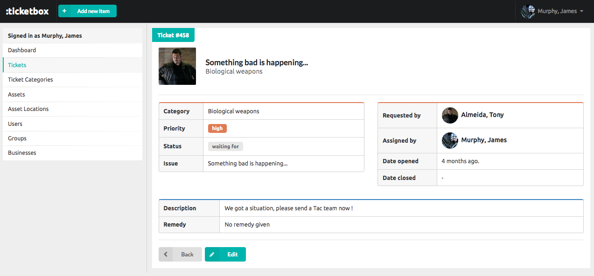
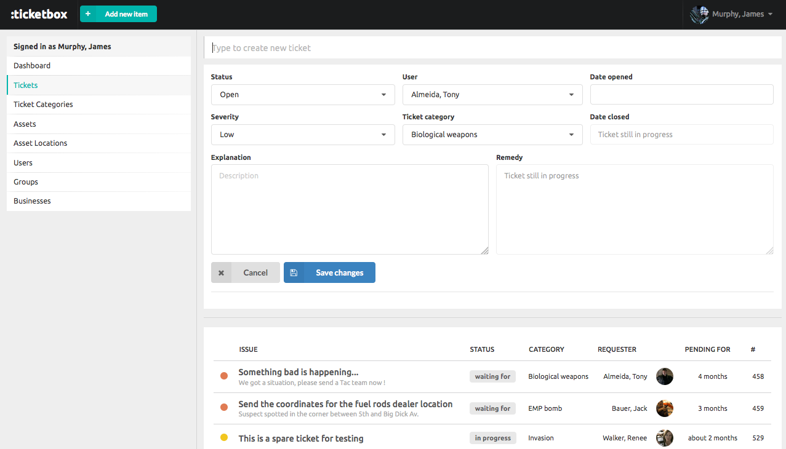
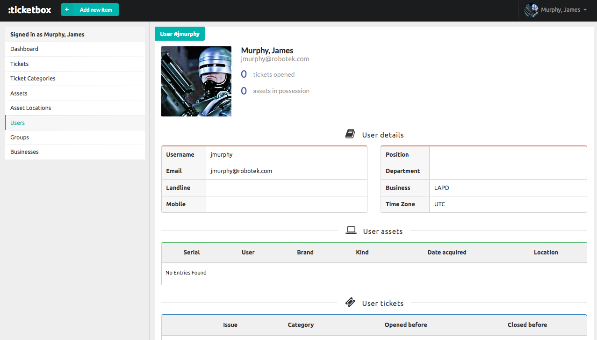
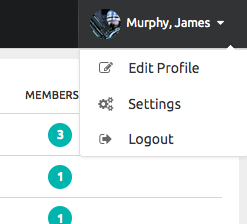

# :ticketbox

:ticketbox is a fast, minimalistic case/ticket management software. It has many features, some of them are:

 - Create tickets, ticket categories, users, groups, assets, businesses and asset locations.
 - Easy updating the status of tickets, including important information about them
 - View the most necessary information in your dashboard, including charts that distribute ticket activity by week or month, public activity of your agents or the top hot tickets that are pending or in progress right now.
 - View your assets by location (e.g. by floor or building), users by business and other useful stuff.

## Why?

Initially, __:ticketbox__ was built as a side project of mine in order to control user requests in a previous job I had as a Senior Service Delivery Analyst. The Java/Oracle tool we had back then was totally crap (bugs in every click, incompatibilities, crashes and a huge lag in all requests), so :ticketbox made me and the users happy - although a decentralized solution.

I didn't have the authority to send email 'internally', that's why actionmailer is missing.

The tests have also been missing and programming techniques may be a little bit 'outdated' as it was created at ~2012-2013.

There are great players out there in the field of HelpDesk and Ticket Management however, I really believe this app can help a 150-200 people company as I have tried it to in the past.

It's simple and efficient, without the bloat and over-engineering other solutions have. I am intended to resume development If I see interest from you, so just let me know.

Thanks for checking out! 

## Screenshots

__View ticket__

__New ticket__

__View User Tickets & Assets__

__Profile Menu__

__Users__

## Requirements

* [Bundler](http://gembundler.com)
* [ImageMagick](http://www.imagemagick.org/script/install-source.php)

## Built With

- [Ruby on Rails](https://github.com/rails/rails) &mdash; The backend API is a Rails app.
- [MySQL](http://www.mysql.com/) &mdash; Our main database is in MySQL.
- [Semantic UI](http://semantic-ui.com) &mdash; We use Semantic UI for the design of the app.

Plus lots of Ruby Gems, a complete list of which is at the *root* folder of the project.

## Instructions

Please don't freak out by the absence of tests. I am currently building my knowledge and soon I will add lots of them.

First create the database:
` rake db:create `

Then create the tables:
 `rake db:schema:load`

## Contributing

:ticketbox is **100% free** and **open-source**. We encourage and support an active, healthy community that accepts contributions from the public &ndash; including you!

We look forward to seeing your pull requests!

## Copyright / License

To be Updated

## Dedication

:ticketbox is built to make us more [productive and happy.]()
